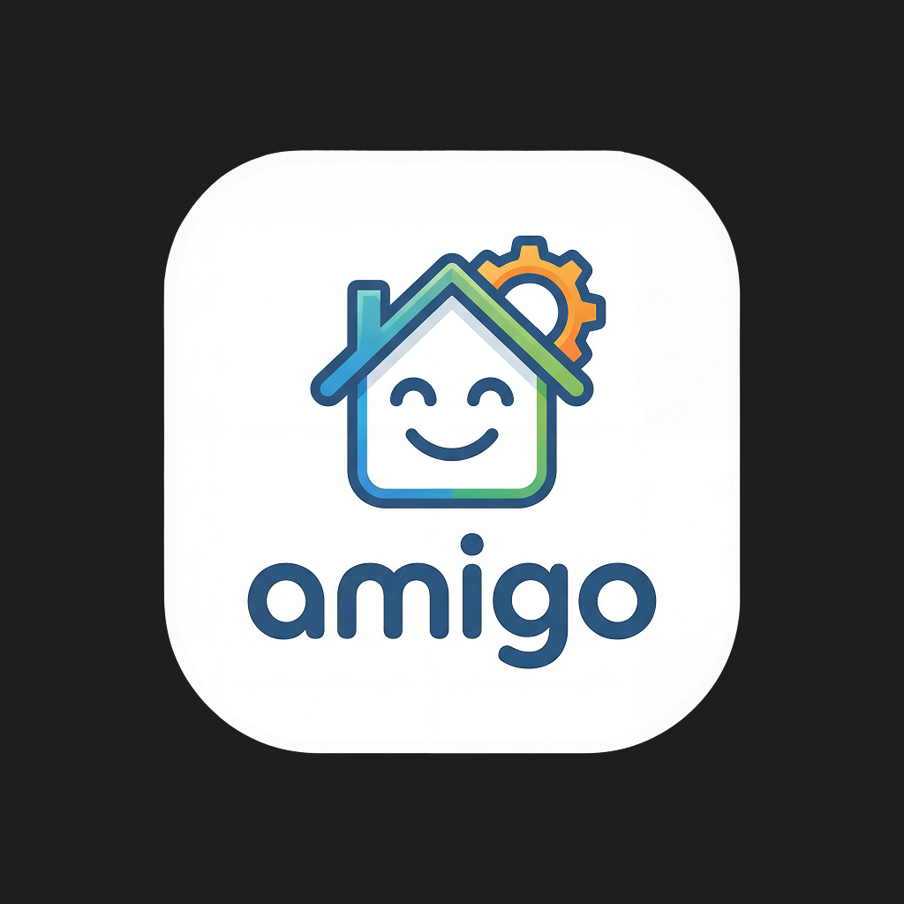

# amigo

<p align="center">
  
</p>

Cloudflare-native household management app for shared budgeting, groceries, assets, debts, and calendar planning. The app runs as a single Worker-backed application with server-rendered React routes, Hono APIs, real-time household updates, and offline-first grocery syncing.

## What It Does

- Shared household dashboard and setup flow
- Budget tracking with transactions, budgets, and recurring entries
- Grocery list management with tags, optimistic updates, and offline sync
- Asset and debt tracking
- Calendar aggregation for household activity
- Household settings, member roles, and account restore flows
- Real-time updates through a household-scoped Durable Object WebSocket hub

## Stack

- Runtime: Cloudflare Workers
- Backend: Hono
- Frontend: React Router v7 framework mode, React 19, Tailwind CSS 4, shadcn/ui
- Data: Cloudflare D1 (SQLite) with Drizzle ORM
- Realtime and caching: Durable Objects, KV, Workers Cache API
- Offline: Dexie + `vite-plugin-pwa`
- Auth: Clerk
- Tooling: Bun, Vite, Wrangler, ESLint, Vitest

## Quick Start

### Prerequisites

- Bun `1.3.10+`
- Node.js on `PATH` for local helper scripts
- Wrangler `4+`
- Clerk development keys
- Optional: 1Password CLI if you use the built-in secret injection flow

### Install and Run

```bash
bun install
bun run dev:setup

export CLERK_SECRET_KEY=sk_test_...
export CLERK_PUBLISHABLE_KEY=pk_test_...

bun run dev
```

Open the local Vite/Workers dev URL printed by `bun run dev`.

### Local Environment Notes

- `bun run dev` does not expect you to maintain `.dev.vars` manually.
- `scripts/run-vite-with-dev-vars.sh` generates a temporary `.dev.vars` file from the keys listed in `.dev.vars.example`, pulling values from the current shell environment.
- `scripts/run-with-1password-environment.sh` will automatically wrap the dev command in `op run` when `OP_ENVIRONMENT_ID` is available in your shell or in `.op/refs.env`.
- If you do not use 1Password, exporting the required environment variables before `bun run dev` is enough.

## Environment and Config

| File / Source | Purpose |
| --- | --- |
| `.dev.vars.example` | Key manifest for local secrets consumed by the dev helper script |
| `.dev.vars` | Temporary file generated at runtime for local Workers bindings |
| `.op/refs.env` or `OP_ENVIRONMENT_ID` | Optional 1Password environment reference for local secret injection |
| `wrangler.jsonc` | Worker name, bindings, routes, cron trigger, observability, and other non-secret config |
| `wrangler secret put ...` | Production secret management, including `CLERK_SECRET_KEY` |

Current Worker bindings in `wrangler.jsonc`:

- D1 database: `amigo-db`
- KV namespace: `CACHE`
- Durable Object: `HOUSEHOLD`
- Static asset binding: `ASSETS`
- Weekly cron: Sunday at `03:00 UTC` for audit log pruning

## Scripts

| Command | Description |
| --- | --- |
| `bun run dev` | Start the local Vite + Workers development server |
| `bun run dev:setup` | Apply local D1 migrations and seed the local database |
| `bun run dev:reset` | Remove local Wrangler state and re-run local setup |
| `bun run build` | Build the React Router app for production |
| `bun run deploy` | Apply remote D1 migrations, then deploy the Worker |
| `bun run db:generate` | Generate Drizzle migrations from schema changes |
| `bun run db:migrate:local` | Apply migrations to the local D1 database |
| `bun run db:migrate:remote` | Apply migrations to the remote D1 database |
| `bun run db:seed:local` | Seed the local D1 database from `packages/db/seed.sql` |
| `bun run db:studio` | Open Drizzle Studio from `packages/db` |
| `bun run typegen` | Generate React Router route types |
| `bun run typecheck` | Run route typegen and TypeScript checks |
| `bun run lint` | Run ESLint |
| `bun run test` | Run Vitest once |
| `bun run test:watch` | Run Vitest in watch mode |

## Project Layout

```text
app/                 React Router UI, route modules, and client-side utilities
server/              Hono app, API routes, middleware, and Durable Objects
packages/db/         Shared D1 schema, migrations, seed data, and DB helpers
public/              PWA icons and other static assets
scripts/             Local development and migration helper scripts
worker.ts            Cloudflare Worker entrypoint with fetch + scheduled handlers
wrangler.jsonc       Cloudflare configuration and bindings
docs/                Architecture notes, changelog, and planning docs
```

Notable route groups:

- `/dashboard`
- `/groceries`
- `/budget`, `/budget/budgets`, `/budget/recurring`
- `/assets`
- `/debts`
- `/calendar`
- `/settings`
- `/setup`
- `/restore-account`

Notable API groups:

- `/api/health`
- `/api/setup`
- `/api/groceries`
- `/api/tags`
- `/api/transactions`
- `/api/budgets`
- `/api/recurring`
- `/api/assets`
- `/api/debts`
- `/api/members`
- `/api/settings`
- `/api/sync`
- `/api/calendar`
- `/api/restore`
- `/api/audit`

## Deployment

`bun run deploy` uses the default Wrangler configuration in [`wrangler.jsonc`](./wrangler.jsonc). In this repo that includes:

- Worker name `amigo`
- Smart placement enabled
- Observability and tracing enabled
- Custom domain route for `mi-amigo.com`
- `workers_dev` disabled

If you want to deploy this project to a different Cloudflare account or domain, update the account, route, and binding IDs in `wrangler.jsonc` before deploying.

## CI

GitHub Actions in [`.github/workflows/ci.yaml`](./.github/workflows/ci.yaml) currently run:

- `bun run lint`
- `bun run typecheck`
- `bun run test`

on pushes to `main` and pull requests targeting `main`.

This workflow does not deploy the app.

## Additional Docs

- [Architecture notes](./docs/ARCHITECTURE.md)
- [Changelog](./docs/CHANGELOG.md)
- [Cloudflare migration design](./docs/plans/2026-03-08-cloudflare-migration-design.md)
- [`scripts/migrate-to-d1.ts`](./scripts/migrate-to-d1.ts) for the one-time PostgreSQL to D1 migration path
