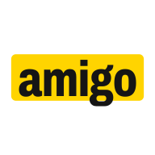

# amigo

[](https://github.com/j-cadena-g/amigo/actions/workflows/ci.yaml)

[](https://github.com/j-cadena-g/amigo/security/code-scanning)
[](https://www.gnu.org/licenses/agpl-3.0)
[](https://pnpm.io)
[](https://www.typescriptlang.org/)
[](https://react.dev/)
[](https://reactrouter.com/)
[](https://clerk.com/)
[](https://orm.drizzle.team/)
[](https://vitest.dev/)
[](https://workers.cloudflare.com/)
[](https://developers.cloudflare.com/d1/)
[](https://developers.cloudflare.com/workers/wrangler/)



Cloudflare-native household management app for shared budgeting, groceries, assets, debts, and calendar planning. The app runs as a single Worker-backed application with **React Router v8 framework mode** (SSR, loaders, actions, and `/api/*` resource routes), real-time household updates over WebSockets, and offline-first grocery syncing.

## What It Does

- Shared household dashboard and setup flow
- Budget tracking with transactions, budgets, and recurring entries
- Grocery list management with tags, optimistic updates, and offline sync
- Asset and debt tracking
- Calendar aggregation for household activity
- Household settings, member roles, and account restore flows
- Real-time updates through a household-scoped Durable Object WebSocket hub

## Stack

- Runtime: Cloudflare Workers
- Server: React Router v8 framework mode (HTTP + `/api/*` resource routes), `apps/web/worker.ts` for `/ws`, cron, and security headers
- Frontend: React 19, Tailwind CSS 4, shadcn/ui (route modules under `apps/web/app/routes/`)
- Data: Cloudflare D1 (SQLite) with Drizzle ORM
- Realtime and caching: Durable Objects, KV, Workers Cache API
- Offline: Dexie + `vite-plugin-pwa`
- Auth: Clerk
- Tooling: pnpm workspaces, Turborepo, Vite, Wrangler, ESLint, Vitest

## How it works

One Cloudflare Worker (`apps/web/worker.ts`) serves everything. React Router v8 framework mode handles SSR, page loaders/actions, and `/api/*` JSON resource routes. There is no separate HTTP framework.

### Design choices

- **Single Worker** — RR plus Worker-only concerns (`/ws`, cron, security headers) in one deployable unit
- **Integer cents** — all money in D1 is stored as integer cents (never floats)
- **Application-level tenancy** — every D1 query must filter with `scopeToHousehold()` from `@amigo/db` (no DB-level RLS)
- **Optimistic groceries** — Dexie (IndexedDB) for instant UI; background sync via `/api/sync` (max 10 mutations per request)

### Request flow

```text
Client → apps/web/worker.ts
  → /ws → Household Durable Object (WebSocket hub)
  → else → React Router (createRequestHandler)
      → clerkMiddleware + app context middleware
      → /api/* resource routes → apps/web/server/api/* handlers
      → page loaders/actions (context.app + context.cloudflare)
```

### Code layout

- `apps/web/app/routes/*.tsx` — pages and `api.*` resource routes
- `apps/web/server/api/*` — shared handlers (Zod validation, D1, rate limits)
- `apps/web/server/durable-objects/household.ts` — per-household WebSocket hub (Hibernation API)
- `packages/db/` — Drizzle schema, migrations, `getDb()`, `scopeToHousehold()`

Sync-enabled tables use `deletedAt` for soft deletes. Schema lives under `packages/db/src/schema/`.

### Realtime

1. Client opens `/ws` → routed to the household’s Durable Object
2. Mutations call `broadcastToHousehold()` in `apps/web/server/lib/realtime.ts`
3. Connected clients receive an event and revalidate loaders
4. Optional `senderId` skips the connection that initiated the mutation

### Auth (Clerk)

- `@clerk/react-router` for middleware, loaders, and client provider
- Session cache in KV (24h TTL, keyed by Clerk user id)
- First login with no household goes to `/setup`. In local development, a Clerk user whose email matches `AGENT_LOGIN_EMAIL` claims the seeded Demo Household instead of creating an empty one.

### Security

KV-backed rate limits (`apps/web/server/middleware/rate-limit.ts`):

| Preset | Limit | Use case |
| --- | --- | --- |
| MUTATION | 30/min | Standard writes |
| BULK | 10/min | Bulk operations |
| SENSITIVE | 10/min | Settings, members |
| READ | 60/min | List reads |

Household roles (`owner` > `admin` > `member`): `canManageHousehold` and `canManageMembers` require owner or admin; `canTransferOwnership` is owner-only. Helpers live in `apps/web/server/lib/permissions.ts`.

### Offline groceries

- Local state in Dexie; sync queue flushed in chunks to `/api/sync`
- Conflicts: server-wins with field-level merge
- PWA via `vite-plugin-pwa` (NetworkFirst for API, CacheFirst for static assets)

## Quick Start

You do **not** need a Cloudflare account, Workers Builds, Cursor Cloud Agent secrets, or a production Environment to open a PR. Local Vite uses simulated D1/KV.

### Prerequisites

- pnpm 11.3.0 (run `corepack enable` to use the version pinned in `package.json`)
- Node.js on `PATH` for local helper scripts
- Wrangler comes with the repo (`pnpm exec wrangler`); a global install is optional
- A **personal** [Clerk](https://clerk.com/) development application (`pk_test_` / `sk_test_`)
- [1Password CLI](https://developer.1password.com/docs/cli/) and **your own** 1Password Environment for secrets (recommended). Each contributor creates and fills their own Environment — there is no shared team vault to request access to. You can instead export the required env vars in your shell; if `OP_ENVIRONMENT_ID` is unset, `pnpm run dev` runs with the current environment.

### Get Clerk keys

1. Create your own Clerk application (Development instance).
2. Copy the publishable key (`pk_test_…`) and secret key (`sk_test_…`).
3. In Clerk, allow the local origin `http://localhost:5190` (and matching sign-in/redirect URLs).

### Install and Run

1. Create a personal 1Password Environment for local development (a common display name is `amigo (dev)`), **or** plan to export required vars in your shell.
2. Set the **required** keys from [`apps/web/.dev.vars.example`](./apps/web/.dev.vars.example): `APP_ENV`, `APP_ORIGIN`, `CLERK_SECRET_KEY`, `CLERK_PUBLISHABLE_KEY`. Cloudflare IDs and VAPID keys are optional for first-run.
3. Then:

```bash
pnpm install
pnpm run dev:setup

cp apps/web/.op/refs.env.example apps/web/.op/refs.env
# Set OP_ENVIRONMENT_ID to the UUID of your personal local-dev Environment
# (skip refs.env if you export the required vars in your shell instead).

pnpm run dev:verify
pnpm run dev
```

Open the local Vite/Workers dev URL printed by `pnpm run dev`.

### Local Environment Notes

- Copy [`apps/web/.op/refs.env.example`](./apps/web/.op/refs.env.example) to `apps/web/.op/refs.env` and set `OP_ENVIRONMENT_ID` to the UUID of **your** local-dev Environment (not someone else’s). Prefer `op run`; if `OP_ENVIRONMENT_ID` is unset, [`scripts/run-with-1password-environment.sh`](./scripts/run-with-1password-environment.sh) falls through to your current shell environment.
- `amigo (dev)` / `amigo (prod)` in this repo are **suggested display names** for personal or operator Environments — not shared Environments contributors are expected to join.
- `pnpm run dev` uses `op run --environment` (when configured) to inject secrets into `process.env`; the Cloudflare Vite plugin reads them directly (`CLOUDFLARE_INCLUDE_PROCESS_ENV`). Do not mount a `.dev.vars` file.
- `pnpm run dev:verify` checks **required** keys from `apps/web/.dev.vars.example` (names only). Missing Cloudflare / VAPID keys print a note and do not fail.
- Secrets and deploy identifiers should live in each person’s (or each operator’s) 1Password Environments; the repo only tracks variable **names** in `*.example` manifests.
- Invite **codes** and `/join/:code` work locally. Outbound invite email uses operator Email Routing (`invites@mail.mi-amigo.com`) and will not send from a contributor machine without that domain — share the code manually instead.
- `pnpm run deploy` also uses `op run` and renders ignored `apps/web/.wrangler.deploy.jsonc` from environment variables, so live Cloudflare IDs and domains do not need to live in git.

## Environment and Config

| File / Source | Purpose |
| --- | --- |
| `apps/web/.dev.vars.example` | Key manifest for local dev (`op run` + `dev:verify`; required vs optional) |
| `apps/web/.deploy.env.example` | Deploy binding IDs and Worker vars (rendered into `apps/web/.wrangler.deploy.jsonc`) |
| `apps/web/.wrangler.secrets.example` | Worker secrets for local dev (`secrets.required`) and deploy (`wrangler deploy --secrets-file`) |
| `apps/web/.op/refs.env.example` | Template for local `OP_ENVIRONMENT_ID` reference (copy to gitignored `apps/web/.op/refs.env`) |
| `apps/web/.op/refs.env` or `OP_ENVIRONMENT_ID` | 1Password Environment reference for `op run` (dev locally / cloud agents, prod in Workers Builds) |
| `apps/web/wrangler.jsonc` | Public-safe Wrangler template used for local development and documentation |
| `apps/web/.wrangler.deploy.jsonc` | Ignored production config rendered at deploy time from environment variables |

Current Worker bindings in the public `apps/web/wrangler.jsonc` template:

- D1 database binding: `DB` (`amigo-db`)
- KV namespace: `CACHE`
- Durable Object: `HOUSEHOLD`
- Static asset binding: `ASSETS`
- Weekly cron: Sunday at `03:00 UTC` for audit log pruning
- Daily cron: `04:23 UTC` for recurring transaction processing

## Scripts

| Command | Description |
| --- | --- |
| `pnpm run dev` | Start the local Vite + Workers development server |
| `pnpm run dev:verify` | Verify required local-dev secrets via `op run` (names only) |
| `pnpm run dev:setup` | Apply local D1 migrations and seed the local database |
| `pnpm run dev:reset` | Remove local Wrangler state and re-run local setup |
| `pnpm run agent:signin-url` | Print a one-time Clerk sign-in URL for local agent UI work |
| `pnpm run build` | Build the React Router app for production |
| `pnpm run deploy` | Apply remote D1 migrations, then deploy the Worker |
| `pnpm run db:generate` | Generate Drizzle migrations from schema changes |
| `pnpm run db:migrate:local` | Apply migrations to the local D1 database |
| `pnpm run db:migrate:remote` | Apply migrations to the remote D1 database |
| `pnpm run db:seed:local` | Seed the local D1 database from `packages/db/seed.sql` |
| `pnpm run db:studio` | Open Drizzle Studio from `packages/db` |
| `pnpm run typegen` | Generate React Router route types |
| `pnpm run typecheck` | Run route typegen and TypeScript checks |
| `pnpm run lint` | Run ESLint |
| `pnpm run test` | Run the unit and Workers integration Vitest suites |
| `pnpm run test:unit` | Unit tests (workspace Vitest + repo script tests) |
| `pnpm run test:integration` | Workers / D1 / Durable Object integration tests |
| `pnpm run test:watch` | Run Vitest in watch mode |

## Project Layout

```text
AGENTS.md            Agent working-loop notes (commands, invariants, auth)
apps/web/            React Router UI, Worker entrypoint, and Cloudflare config
apps/web/app/        Route modules, frontend components, and client utilities
apps/web/server/     Shared API handlers, middleware, libs, and Durable Objects
packages/db/         Shared D1 schema, migrations, seed data, and DB helpers
scripts/             Local development and migration helper scripts
turbo.json           Turborepo task graph
CHANGELOG.md         Release history
```

Notable route groups:

- `/dashboard`
- `/groceries`
- `/financial` — transactions, recurring rules, budgets, accounts, and debts (legacy `/budget` → `/financial`, `/accounts` → `/financial/accounts`, `/assets` → `/financial/accounts`)
- `/financial/debts` — debts (legacy `/debts` → `/financial/debts`)
- `/calendar` — redirects to `/dashboard`
- `/settings`
- `/setup`
- `/restore-account`

Notable API groups:

- `/api/health`
- `/api/setup`
- `/api/groceries`
- `/api/tags`
- `/api/transactions`
- `/api/budgets`
- `/api/recurring`
- `/api/assets`
- `/api/debts`
- `/api/members`
- `/api/settings`
- `/api/sync`
- `/api/calendar`
- `/api/restore`
- `/api/audit`

## Deployment

`pnpm run deploy` first renders `apps/web/.wrangler.deploy.jsonc` from the current shell environment, then uses that ignored file for remote D1 migrations and the Worker deploy. The committed [`apps/web/wrangler.jsonc`](./apps/web/wrangler.jsonc) stays as a public-safe template.

Operators should store production and development secrets in [1Password Environments](https://www.1password.dev/environments/) (or an equivalent secret store). Contributors use **their own** local-dev Environment for day-to-day work. The repo tracks **names** in [`apps/web/.deploy.env.example`](./apps/web/.deploy.env.example) and [`apps/web/.wrangler.secrets.example`](./apps/web/.wrangler.secrets.example). Do not use `wrangler secret put` or the Cloudflare dashboard to author secrets — `pnpm run deploy` renders a temporary secrets file from `op run` and passes it to `wrangler deploy --secrets-file`.

Suggested Environment display names (create these in **your** 1Password account; they are not shared project vaults):

- **`amigo (dev)`** — local `pnpm run dev` (`OP_ENVIRONMENT_ID` in `apps/web/.op/refs.env`).
- **`amigo (prod)`** — Cloudflare Workers Builds / production deploy (`OP_ENVIRONMENT_ID` build secret). Only needed if you operate a deployment.

Each Environment should define every key from the relevant manifests (dev vs prod values differ, e.g. `pk_test_` vs `pk_live_`). Local-dev Environments only need the **required** keys in `.dev.vars.example` for day-to-day work.

Local deploy (operators): copy [`apps/web/.op/refs.env.example`](./apps/web/.op/refs.env.example) to `apps/web/.op/refs.env`, set `OP_ENVIRONMENT_ID` to **your** production Environment UUID, then `pnpm run deploy`. The deploy renderer defaults `APP_ENV` to `production`; if you intentionally deploy against dev-scoped bindings, set `APP_ENV=development` before running `pnpm run deploy`.

### Cloudflare Workers Builds

Git-connected production deploys must not use the placeholder [`apps/web/wrangler.jsonc`](./apps/web/wrangler.jsonc) alone. After [#53](https://github.com/j-cadena-g/amigo/pull/53), the build must render `apps/web/.wrangler.deploy.jsonc` with real binding IDs.

This section is for **operators** of a deployment, not required for opening PRs:

1. Use **your** production 1Password Environment (commonly named `amigo (prod)`) for production binding IDs and deploy keys. Keep a separate local-dev Environment (commonly `amigo (dev)`) for day-to-day development.
2. Add every key from [`apps/web/.deploy.env.example`](./apps/web/.deploy.env.example) and [`apps/web/.wrangler.secrets.example`](./apps/web/.wrangler.secrets.example) to that production Environment.
3. Add Workers Builds secrets: `OP_SERVICE_ACCOUNT_TOKEN` (read-only service account) and `OP_ENVIRONMENT_ID` set to **your** production Environment UUID.
4. Workers Builds commands (Worker **Settings → Build**):
   - **Build:** `pnpm install && pnpm run build`
   - **Deploy:** `pnpm run deploy`

If Workers Builds was still running plain `wrangler deploy` against the template config, the post-merge failure is expected: add the bootstrap secrets and set the deploy command above.

The generated deploy config contains:

- Worker name `amigo`
- Smart placement enabled
- Observability and tracing enabled
- Custom domain route from `CLOUDFLARE_CUSTOM_DOMAIN`
- `workers_dev` disabled

If you want to deploy this project to a different Cloudflare account or domain, change the deploy-time environment variables instead of editing the committed `apps/web/wrangler.jsonc`.

## Cursor Cloud Agents (operators / maintainers)

Optional. Not required to contribute or open a PR. Day-to-day agent commands and invariants: [AGENTS.md](./AGENTS.md).

Cursor cloud agents should **not** copy individual app secrets into the Cursor dashboard. Use the same bootstrap pattern as Cloudflare Workers Builds, pointed at **your** local-dev Environment:

1. Create a read-only 1Password service account scoped to **your** local-dev Environment only (separate from any production Workers Builds token).
2. In Cursor → Cloud Agents → your amigo environment → Secrets, add only:

| Secret | Cursor type | Value |
| --- | --- | --- |
| `OP_SERVICE_ACCOUNT_TOKEN` | Runtime Secret | Read-only service account with access to **your** local-dev Environment only |
| `OP_ENVIRONMENT_ID` | Environment Variable | UUID of **your** local-dev Environment |

Do not add Clerk keys, VAPID keys, Cloudflare binding IDs, agent login passwords, or other keys from `apps/web/.dev.vars.example` to Cursor. Commands like `pnpm run dev` and `pnpm run dev:verify` inject them via `op run --environment` through [`scripts/run-with-1password-environment.sh`](./scripts/run-with-1password-environment.sh). Cloud agents resolve `OP_ENVIRONMENT_ID` from Cursor secrets (not from gitignored `apps/web/.op/refs.env`).

### Agentic Clerk login

Cloud agents still need a signed-in Clerk user to use the app UI. Do **not** commit passwords to git.

1. In **your** Clerk Development application, create a dedicated user for agents (for example `agent@example.com`) with a password you control. Use that same email as `AGENT_LOGIN_EMAIL` so local first login claims the seeded Demo Household (`hh-seed-001`) instead of `/setup`.
2. Add these keys to **your** local-dev 1Password Environment (see [`apps/web/.dev.vars.example`](./apps/web/.dev.vars.example)):

| Key | Purpose |
| --- | --- |
| `AGENT_LOGIN_EMAIL` | Clerk Development user email; required for local first login to claim the seeded Demo Household |
| `AGENT_LOGIN_PASSWORD` | Optional last-resort Clerk form fill; prefer `pnpm run agent:signin-url` |

1. When the agent needs a signed-in browser session, with `pnpm run dev` already up, run `pnpm run agent:signin-url` and open the URL on stdout immediately (Clerk Agent Task, or a hash `__clerk_ticket` fallback). Do **not** print `AGENT_LOGIN_PASSWORD`, disable masking, or paste the URL into logs, PRs, or chat. Filling the hosted Clerk form is a last resort only.

Other developers doing agentic work should seed the same pattern in **their** Clerk app and Environment.

For the cloud environment **install/update** command, use `pnpm install && pnpm run dev:setup` (local D1 only; no app secrets required). After bootstrap secrets are set, run `pnpm run dev:verify` to confirm your Environment is complete (names only).

Before opening a PR from a cloud agent: `pnpm run dev:verify`, `pnpm run typecheck`, `pnpm run test:unit`, and relevant `pnpm run test:integration` when touching Workers/D1/DO code. See [AGENTS.md](./AGENTS.md).

## CI

GitHub Actions in [`.github/workflows/ci.yaml`](./.github/workflows/ci.yaml) currently run the root compatibility scripts, which fan out through Turborepo and workspace filters:

- `pnpm run lint`
- `pnpm run typecheck`
- `pnpm run typegen`
- `pnpm run db:migrate:local`
- `pnpm run test`

on pushes to any branch and pull requests targeting `main`.

This workflow does not deploy the app.

### Main branch protection

For security hardening, `main` uses a repository ruleset: pull requests with review, required CI and CodeQL checks, signed commits, and linear history. **Merge commits are disabled** at the repository level; changes land via squash or rebase merge only. See [Contributing § Main branch policy](./CONTRIBUTING.md#main-branch-policy-security-hardening) for contributor-facing details.

## License

Copyright © 2026 James Cadena.

[GNU Affero General Public License v3.0](LICENSE) (SPDX `AGPL-3.0`). AGPL is a **strong copyleft** license: modified versions must stay under the same license when conveyed, and if you run a modified version as a **network service** for others, you generally must offer them the corresponding source as well (see section 13 of the license). This is not legal advice; read the full text in `LICENSE`.

## Additional Docs

- [AGENTS.md](./AGENTS.md) — commands, invariants, and local agent login
- [Changelog](./CHANGELOG.md) — release history
- [Contributing](./CONTRIBUTING.md) — development setup, PR expectations, AGPL note
- [Security](./SECURITY.md) — reporting vulnerabilities responsibly
